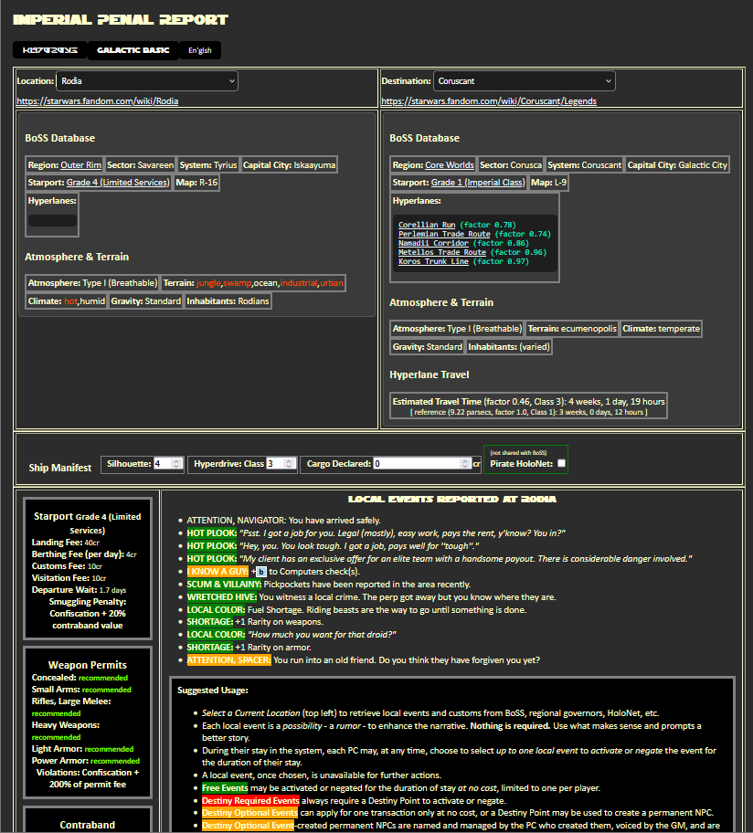
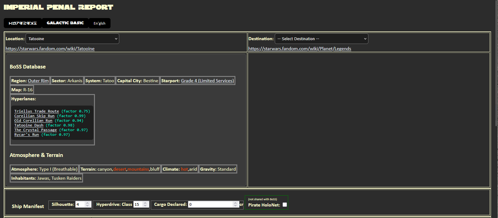
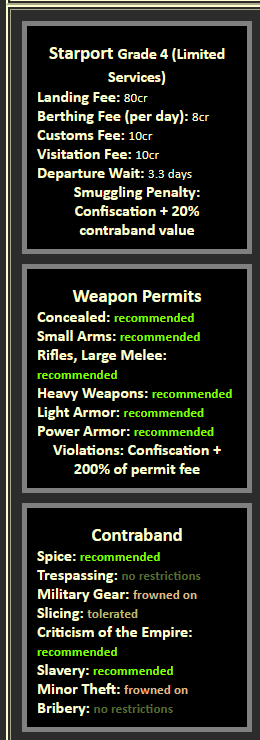
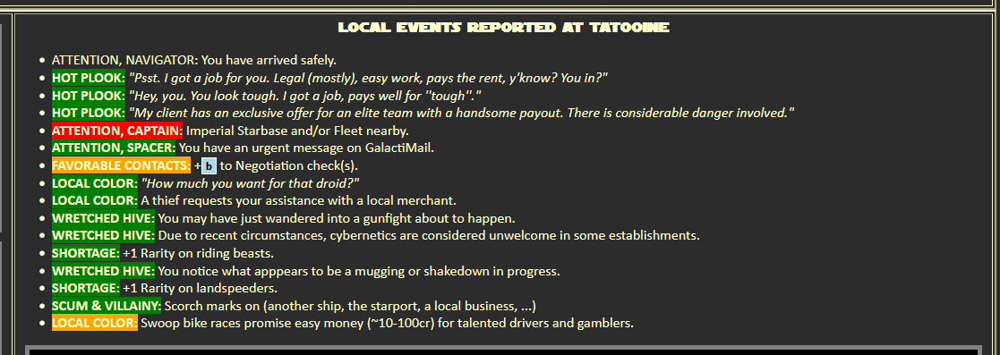
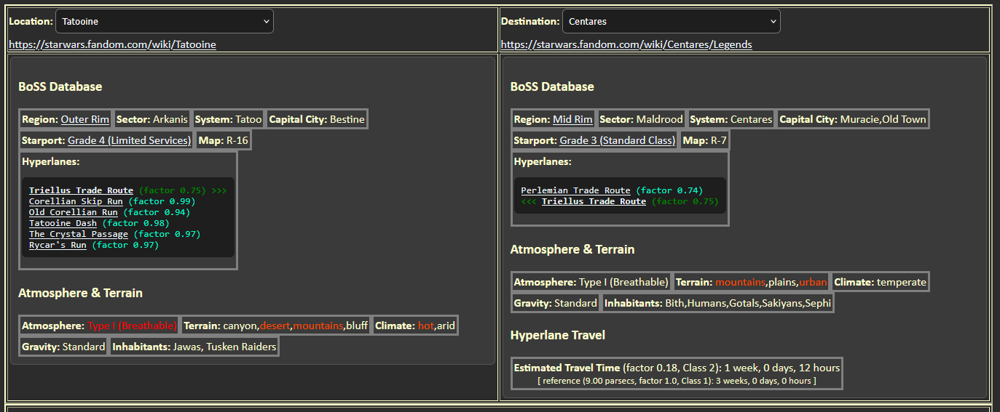
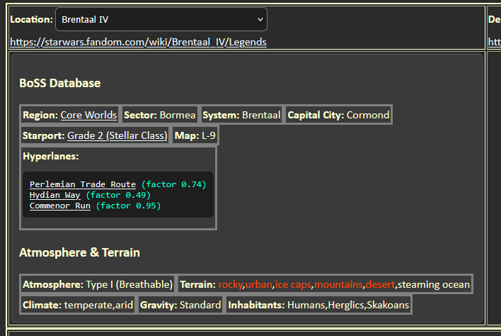
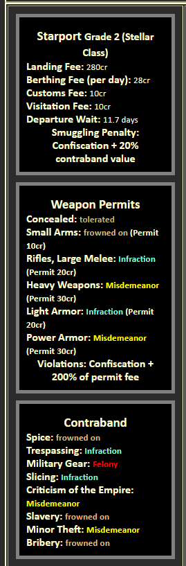
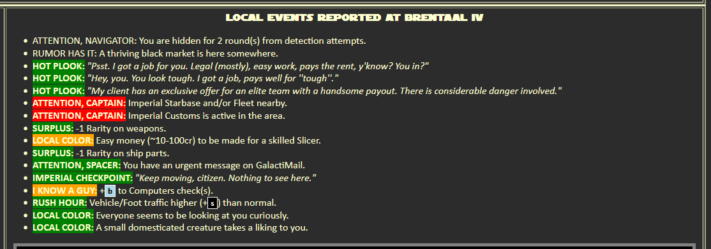
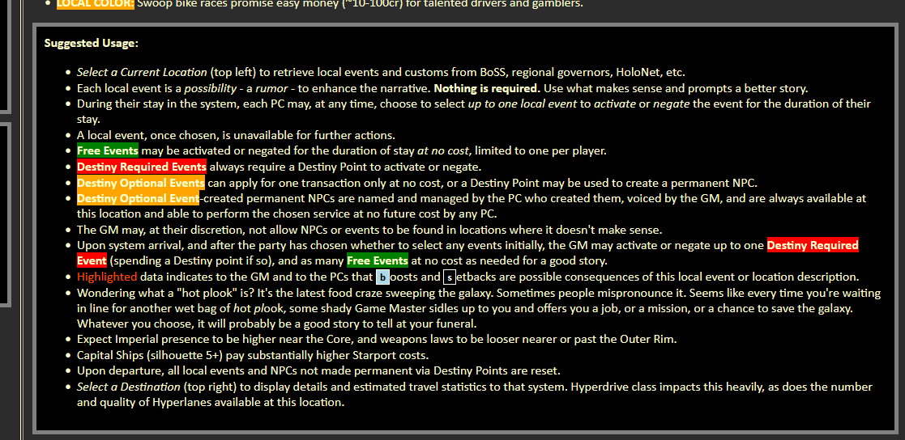

# ImpPeRe

## Description

Edge of the Empire, pg 384, says:
The travel and astrogation data collected by BoSS goes into constantly updated bulletins transmitted by the [Imperial Space] Ministry. The Ministry also monitors BoSS data and other factions to spot trends in piracy, smuggling, or other spaceborne crime.
The Ministry also updates and publishes the Spacer's Information Manual, which among other things details the Imperial Penal References. More commonly called the "ImpPeRe" by the average spacer,...

## Installation

Static information, no back end database is required (or usable, for that matter). Publish to your domain, or copy the files locally and run as a file:/// URL.

## Usage

This is an attempt to provide several useful resources for both GM's and players:
* General data on the current location, including highlights where gravity, climate, or terrain might spark ideas for boosts and setbacks,
Local data such as starport landing fees, local weapons laws, acceptance of slavery, etc., as a starting point for sparking "hey, you can't bring that droid in here!"-type local flavor. Starport fees are based on ship silhouette and distance from the Core Worlds. Customs fees are based on declared cargo value, with a minimum of 10cr if they inspect you.
* Semi-random local events such as "I know a guy. He can help me with my Mechanics problem." or "You are cordially invited to a gambling event". These are intended as one-time-only quick checks of the relevant skill for a quick payout (~100cr max) or as events which both sides can use to their advantage, such as "a work crew is blocking the road you need" (obvious for the GM, but players can see a source of energy to explode, or a distraction for law enforcement, or a vehicle to steal).
* Some events are more powerful and require a Destiny Point to activate or negate.
* Some events can be activated for one transaction (i.e., +boost to a Xenology check) at no cost, or the player may choose to spend a Destiny Point to create a permanent NPC at this location who can provide this function in the future. Obi-wan and Dexter Jettster is the inspiration for this.
* You should see more Empire-y events closer to the Core Worlds and more Old West-y events closer to the Outer Rim. Individual locations have adjustments to these for acceptance of weapons, slaves, criticism of the Empire, etc. Both regions and locations have modifiers for relevant laws & customs.
* Select a destination (in addition to a current location) for an estimate on Hyperspace travel time. Locations with more Hyperlane connections reduce the travel time, and the quality of the Hyperlanes also influences this; two locations that share the same Hyperlane get a big bonus to this as well. Travel time is influenced by Hyperdrive Class as a direct multiplier of the reference travel time (no hyperlanes, Class 1 drive).

The idea is that whenever the players arrive in a new location, the ImpPeRe is consulted. Each player can choose to activate or negate one of the local events (each of which is just a rumor until someone chooses it). Then the GM can choose an event to activate or negate, if they want to.

The data is mostly canon, but where data was insufficient intelligent estimates were added.

I'm looking for feedback in general, and suggestions for local flavor in two categories:
* "Empire" events, such as "LOCAL COLOR: The local politician greets you at the landing site."
* "Old Westy" events, such as "THE HERO OF: You are mistaken for a local hero. Free drinks as long as you can keep up the ruse."

Everything is a suggestion for players and GMs to add flavor to the narrative. Use what parts your group likes and ignore the rest.

Screenshots:

## License

GNU GENERAL PUBLIC LICENSE Version 3
